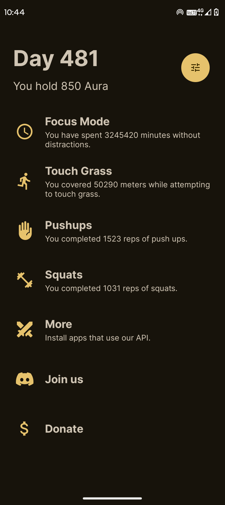
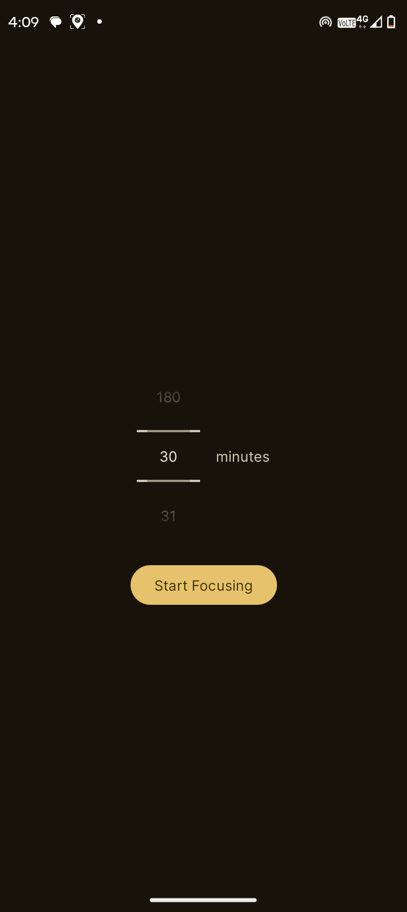
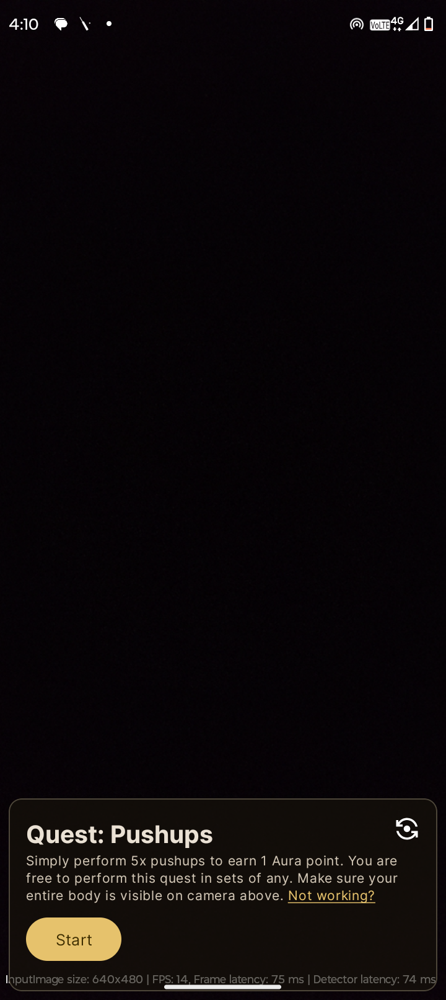
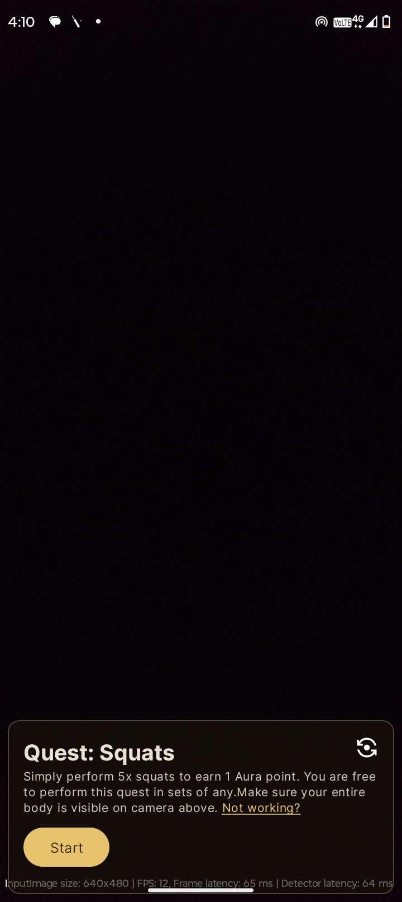
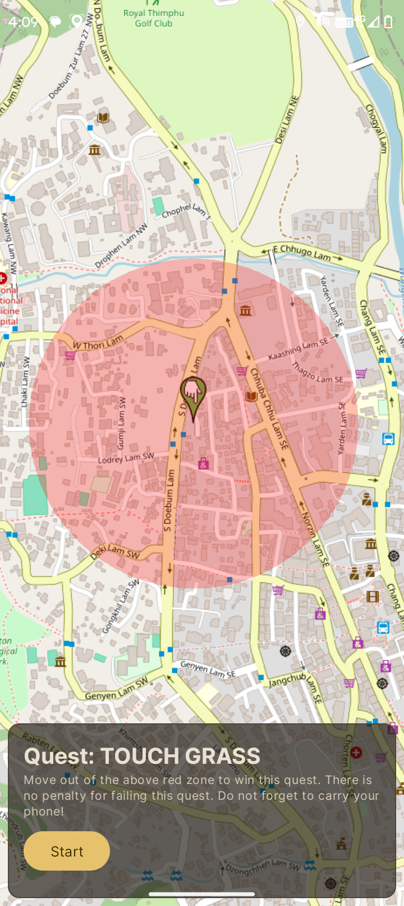
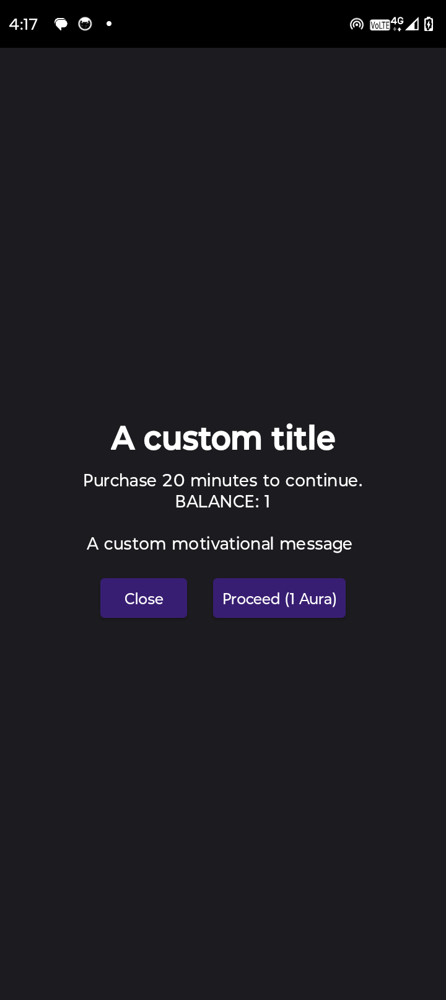

<div align="center">
  
   <h2>DigiPaws</h2>
   
   [](https://github.com/nethical6/digipaws/graphs/contributors)
   [](https://discord.com/invite/Vs9mwUtuCN)
   [](https://t.me/digipaws6)
   [](https://github.com/nethical6/digipaws/releases)
   [](https://github.com/nethical6/digipaws)
</div>

<div align="center">
<a href="https://play.google.com/store/apps/details?id=nethical.digipaws&hl=en_IN&pli=1">
    
</a>  
<a href="https://f-droid.org/packages/nethical.digipaws/">
    
        </a>
</div>
Copylefted libre software solving screen addiction by regulating and gamifying app usage. Easy, Adventure, and Hard modes — each with features and challenges for healthy screen-time habits.


> [!IMPORTANT]  
>This project is being re-written in Kotlin with a new UI

> [!CAUTION]
> This project is experimental and not yet quite ready. [Donate](https://nethical6.github.io/digipaws/donate)

> [!CAUTION]
> If stuck and unable to uninstall the app, it is possible via the safe mode. ][How to enter safe mode](https://www.androidauthority.com/how-to-enter-safe-mode-android-801476/)


## Features

- **Three Unique Modes**: Easy, adventure, or hard.
- **Gamified Challenges**: Earn Aura through quests like walking to unlock blocked-app usage.
- **Open Source**: Fully transparent and gratis. Source code and contributions.
- **Productivity Enhancement**: Healthier digital habits and reduced screen addiction.
- **Versatile Blockers**: Blocking apps, keywords, and unwanted in-app screens (e.g., YouTube shorts, comments).
- **Open API**: Turn your existing apps into a quest. [Learn More](https://nethical6.github.io/digipaws/partners/)

## Screenshots
Click on any image to enlarge it.
<table>
	<tr>
		<td></td>
		<td></td>
		<td></td>
		<td></td>
		<td></td>
		<td></td>
	</tr>
</table>

## Modes

### Easy Mode

Genntle reminders repeated to keep you honest.

### Adventure Mode

The slop is in the immediacy of a quick km walk away, which might be a safe distance. \
Requires Aura earnt through quests to access a blocked app for 20 min. With every quest, the  difficulty rises.

#### Quests
1. **Touch Grass** — Displace yourself out of the red zone on map. Verified using GPS.
2. **Squats** — Simply perform squats. Verified using AI.
3. **Pushups** — Simply perform pushups. Verified using AI.
4. **Focus Quest** — Apply the 90/20 study rule: Only basic productivity apps like calling and SMS.
5. **Open API** — Learn [how to use our API](https://github.com/nethical6/digipause/blob/main/HowToUseApi.md)

> [!IMPORTANT]  
> A custom time can be set for focus quest in hard- or easy mode.

### Hard Mode

Prevents use of blocked apps altogether.

## Variants
There are two build variants with different features:

- `fullMode:` Contains additional inbuilt quests like touch grass, and workout. Requires google play services. [Download](https://github.com/nethical6/digipaws/releases)
- `liteMode:` Reduced size. (same as the F-Droid version) Contains a bare version without additional quests except focus quest. \
Relatively smaller in size and doesn't require Google Play services.

Note that the quest API works with both variants

## Configuring

1. Launch DigiPaws.
2. Grant necessary permissions like accessibility, notification, draw over other apps, etc.
3. On Android 13+ devices, additionally allow restricted settings before turning on the accessibility permission. Watch a tutorial [here](https://yewtu.be/watch?v=91B72lEpcqc)
4. Choose your preferred mode: Easy, adventure, or hard.
5. Pick apps and views to block and set your preferences.
6. Enjoy life and managed screen-time.


> [!TIP]  
> This app relies on sensitive accessibility services to function. \
Avoid downloading it from untrusted sources.

## ToDo
- [x] Block reels.
- [x] Block comments.
- [x] Block explicit context.
- [x] App blockers.
- [x] Focus quest.
- [x] Anti-uninstall.
- [x] Customisable warning screen.
- [x] API for other developers to transform their existing apps into quests!
- [ ] Geo-blocker (basically block things when a certain area is entered, like workplace).
- [ ] Block cusomtom user defined keywords.
- [ ] Modular and downloadable view blockers.
- [ ] Expand the app to ios and desktop.

## Thanks
- [**Osmdroid**](https://github.com/osmdroid/osmdroid) : Map view used in Quest "TouchGrass"
- [**Digital Wellbeing Experiments Toolkit**](https://github.com/googlecreativelab/digital-wellbeing-experiments-toolkit) : some ideas ig, basically the geoblocker one.
- [**Undraw**](https://undraw.co) : Illustrations on the intro page
- Special thanks to all the premium apps that inspired me to create a copylefted libre alternative, gratis. \
  Imagine making money on the misery of people.
- [**Ml Kit QuickStart**](https://github.com/googlesamples/mlkit/tree/master) : ML models and multiple classes were used from this repository.

## Contributing

Contributions welcome. Please follow these steps:

1. Fork the repository.
2. Create a new branch for your feature or bugfix.
    ```sh
    git checkout -b feature/your-feature-name
    ```
3. Commit your changes.
    ```sh
    git commit -m "Add some feature"
    ```
4. Push to the branch.
    ```sh
    git push origin feature/your-feature-name
    ```
5. Create a new pull request.

Please ensure your code adheres to the coding standards and includes relevant tests.

## Contributors
- [Henry Delallal](https://github.com/HenriDellal): assisted in setting up the F-Droid version
- [Remaker17](https://github.com/remaker17): setting up workflow files
- Error 404: helped reach a larger audience

### HELP REQUIRED!!
1. Implementing dyanimic colors inside the warning overlay.
2. Expanding the list of [explict keywords](https://github.com/nethical6/digipause/blob/da5723915412277655aea4dd448cdc64a21fcc83/app/src/main/java/nethical/digipaws/data/BlockerData.java#L28)
3. Expanding the list of [Blocked view items](https://github.com/nethical6/digipause/blob/main/app/src/main/java/nethical/digipaws/data/BlockerData.java#L4) so that more apps can be supported. You can scrape the view IDs of a screen with the help of [Developer Assistant](https://play.google.com/store/apps/details?id=com.appsisle.developerassistant). Remeber these view IDs must be unique and only present on the screen to block!
4. Adding more info about other packages [here](https://github.com/nethical6/digipause/blob/main/app/src/main/java/nethical/digipaws/data/BlockerData.java)


## License

Licensed under the [GPL 3 or later licence](LICENSE). \
You are free to use, modify, and distribute this software in accordance with the license.

## Contact

For questions, suggestions, or feedback, please open an issue on the [GitHub repository](https://github.com/nethical6/digipaws/issues) or get in contact at:
1. Discord: @nethical
2. Telegram: @nethicalps

---

Thank you for using DigiPaws! Together, we create healthier habits.
